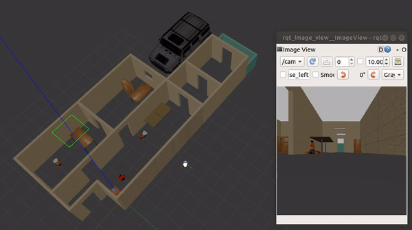
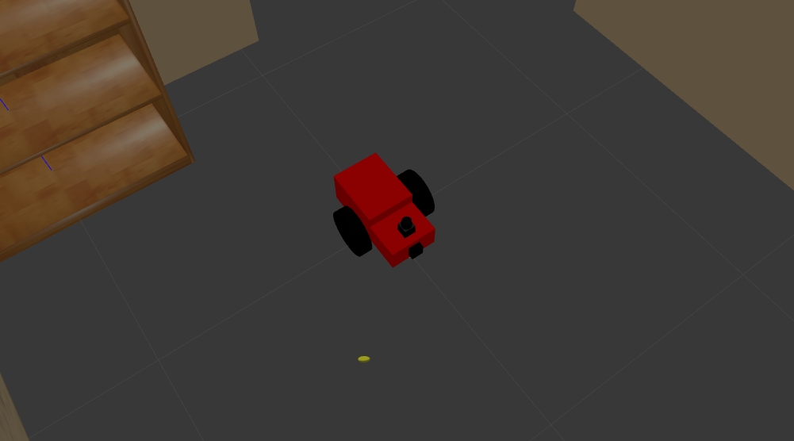

# ROS - Mobile Robot
This is a ROS workspace created on Ubuntu 18.04. The workspace is for the simulation of a differential mobile robot built from scratch. The robots includes sensors and actuators plugins. The robot is simulated in a a world file that I created based on the design of my house. The world environment is available [here](https://github.com/Robotawi/gazebo_world), if you like to download and use it.

## Installation

- #### Prerequisite
    - ROS melodic on ubuntu 18.04.
    - All ROS dependencies are satisfied.
    - Gazebo simulator is installed.

- #### Clone

    ```
    git clone https://github.com/Robotawi/mobile-robot_ros.git
    ```

- #### Setup
    ```
    cd mobile-robot_ros
    catkin_make
    source ./devel/setup.bash
    ```
## Package description
There are two packages in this ROS workspace. The first is responsible for spawning the robot model in Gazebo simulator. The second incorporates two nodes which implement visual perception and actuation of the robot. The robot is set to follow a white ball that appears in the view of its camera, and stop otherwise. 



**To launch the simulation world:**
```
roslaunch my_robot world.launch
```

**The above roslaunch command does the following:**
- Set the robot description param and include the robot_description.launch file.
- Set the world file and the robot initial pose in it.
- Start Gazebo, load the world, and spawn the robot model.
- Start rviz for visualization of the robot sensors.
  
**To launch the visual perception and actuation nodes:**
```
roslaunch ball_chaser ball_chaser.launch
```
**The above command will do the following:**
- Start the vision processing node and detect where the white object is, on the left, middle, or the right of the camera image.
- Start the actuation node and drive the robot based on the visual feedback returned from the above node.

 The camera image is visualized through `rqt_image_view` node. The camera topic is `/camera/rgb/image_raw`.
```
 rosrun rqt_image_view rqt_image_view 
```


## The robot design

The robot is a differential drive mobile robot that I bulit from scratch. The model includest two sensors; a camera and a LIDAR as shown below.




## Contact
In this project, I built everything from scratch because I love to understand how the internals of ROS work. This is a step towards my aim to actively contribute to robotics open-source software.

If you are interested in the presented work/ideas or if you have any questions, please feel free to connect with me on [LinkedIn](https://www.linkedin.com/in/mohraess). We can discuss about this project and other interesting projects.
