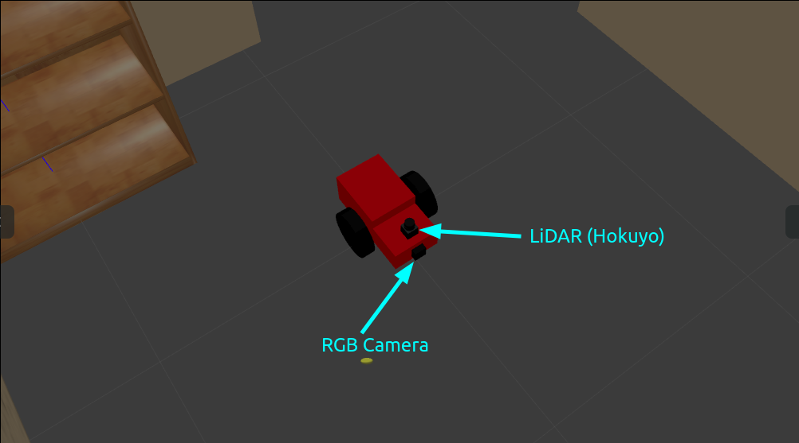
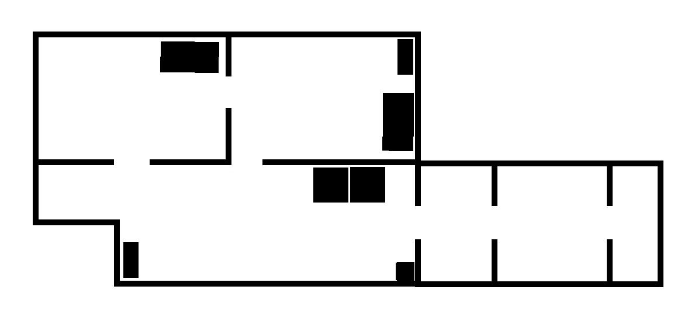
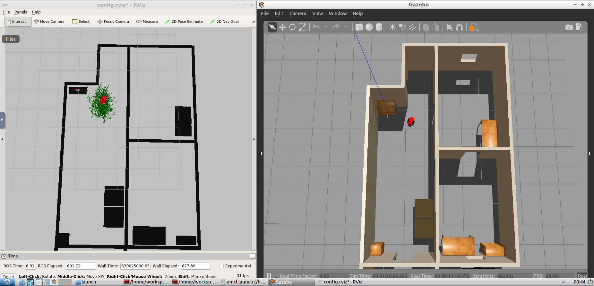
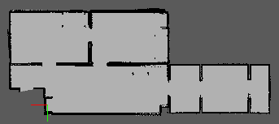
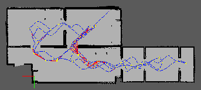

# ROS - Mobile Robot

Welcome to my collection of projects where I simulated a simple mobile robot and tackled some of the core problems in navigation using ROS tools. Through those projects, I aimed to gain familiarity with ROS navigation and explore how they can be used to solve navigation problems.

In this projects collection, I solved the localization problem, the SLAM problem, and enabled autonomous navigation using ROS packages. To tackle the localization problem, I used the Adaptive Monte Carlo Localization (AMCL) algorithm, which allowed me to estimate the robot's position and orientation within a known map. I used the Real-Time Appearance-Based Mapping (RTAB-Map) package to construct a map of the environment and solve the Simultaneous Localization and Mapping (SLAM) problem.

In addition, I have implemented autonomous navigation by using the ROS Navigation Stack, which enabled the robot to plan its path and avoid obstacles in real-time.

**I will show next the designed world, the robot model, and results obtained for the navigation problems.**

## World design 

I prepared a Gazebo simulation environment that is designed to resemble the layout of my apartment. This environment is intended to serve as a testing ground for experimentation and to facilitate the application of navigation algorithms.

By using Gazebo's building editor and online model library, I have constructed a three-dimensional representation of my apartment, including walls, furniture, and other objects. The world environment is available [here](https://github.com/Robotawi/gazebo_world), if you like to download and use it.

The next animation shows the designed world and feedback from robot camera fixed on the robot model spawned in Gazebo simulator. The warm up task I made was to task the robot to follow a white colored ball based on the visual (camera) feedback. 

## Robot design

I developed a custom differential drive mobile robot model from scratch using URDF primitives, which incorporates sensors to enable environmental awareness and intelligent decision-making for the next steps to come.

The robot is equipped with an camera and a LIDAR sensor. The camera input is utilized by a node that uses computer vision techniques to identify and track a white ball that appears within the robot's field of view as shown before.

The differential drive actuator plugin has been incorporated. The movement is commanded either in a tele-operated manner using keyboards, or algorithms in the last autonomous navigation phase.

## Solving the localization problem

Localization is the problem of estimating the robot's pose (position and orientation) within a known map of the environment. To solve this problem, I generated the map of my Gazebo world and used Adaptive Monte Carlo Localization (AMCL), and its ROS package for mobile robot localization. The auto-generated map of my Gazebo world is shown below. 

AMCL is a probabilistic algorithm that uses a particle filter to estimate the robot's pose (position and orientation) in a given environment. It works by sampling a set of particles, where each particle represents a possible pose of the robot. These particles are then propagated through the environment based on the robot's motion and sensor readings.

As the robot moves, the particle filter is updated using sensor data to weight each particle according to how well it matches the sensor data. The particles with higher weights are then resampled, and the process is repeated. Over time, the particles converge towards the robot's true pose, and the estimated pose becomes more accurate.

### The localization result

The following screenshot shows the robot pose in the simulated environment and the corresponding map. The poses are the same which indicates successful localization. 

## Solving the SLAM problem

SLAM (Simultaneous Localization and Mapping) is the problem of constructing a map of an unknown environment while simultaneously estimating the robot's pose (position and orientation) within that environment. I utilized RTAB-Map (Real-Time Appearance-Based Mapping) and its corresponding ROS package, which employs visual data  to solve the SLAM problem in real-time, in order to address this issue.

RTAB-Map uses a feature-based approach to extract keypoint features from visual data and then matches these features across different camera frames to construct a map. It also uses loop closure detection to detect revisited locations and to optimize the map over time. This combination of feature-based mapping and loop closure detection makes RTAB-Map a powerful tool for solving the SLAM problem.

### The mapping results

The resulting map using Real-Time Appearance-Based Mapping 

One aspect of getting successful results is having loop closures, which are added in the following map. 

The resulting 3D map shows a correctly reconstructed environment from the sensors data. 

## Autonomous Navigation 

After solving the SLAM problem, we can use Rviz as well as programmed input to test the navigation performance. 

Using Rviz GUI to move the robot: 

Using programmed input to move the robot: 

The last navigation result simulates a pick and place task in which the robot takes the pick up place (or start point) as the upper left room, and the target point is the room on the bottom right. We can see the robot moving autonomously between the start and the end given the reliable map information collected using in the previous step. 

## Contact
If you are interested in the presented work/ideas or if you have any questions, please feel free to connect with me on [LinkedIn](https://www.linkedin.com/in/mohraess). We can discuss about this project and other interesting projects.
